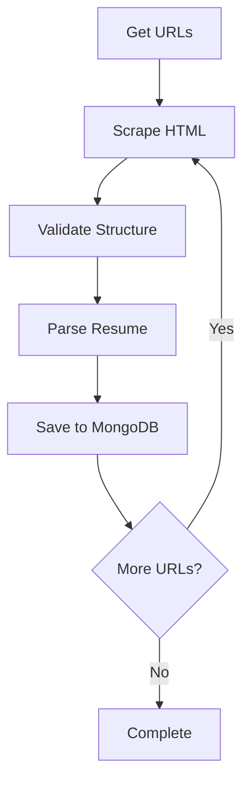
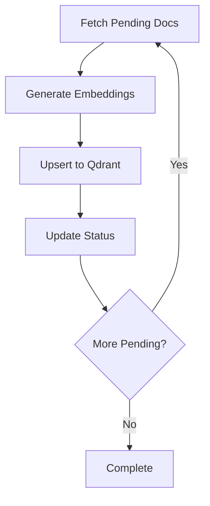

# Data Scraping & Ingestion Pipeline - Developer Manual

## Table of Contents

1. [Overview](#overview)
2. [Data Scraping Pipeline](#data-scraping-pipeline)
3. [Data Ingestion Pipeline](#data-ingestion-pipeline)
4. [Configuration Guide](#configuration-guide)
5. [Common Workflows](#common-workflows)
6. [Troubleshooting](#troubleshooting)

---

## Overview

This RAG system has two main pipelines:


1. **Data Scraping Pipeline** - Scrapes resumes from websites and stores them in MongoDB
2. **Data Ingestion Pipeline** - Processes MongoDB documents and creates embeddings in Qdrant

---

## Data Scraping Pipeline

### File Location

```
src/data_acquisition/run_data_scraping.py
```

### How It Works

The scraping pipeline performs the following steps:



### Running the Scraper

#### Basic Usage

**Current Implementation (No Command-Line Args):**

```bash
# Run the data scraping pipeline
python3 -m src.data_acquisition.run_data_scraping
```

> **Note:** The data scraping script currently does NOT support command-line arguments. All configuration is done via the `scrape_config.yaml` file (see [Configuration Guide](#configuration-guide)).

#### What Happens When You Run It

1. **Load Configuration** - Reads `src/core/scrape_config.yaml`
2. **Fetch URLs** - Gets resume URLs from configured categories
3. **Skip Existing** - Checks MongoDB to avoid re-scraping
4. **Parallel Scraping** - Uses ThreadPoolExecutor (5 workers) to scrape multiple resumes simultaneously
5. **Validate & Parse** - Validates HTML structure and extracts structured data
6. **Batch Save** - Saves to MongoDB in batches of 20 (configurable in code)
7. **Error Handling** - Failed resumes are saved to `failed_resumes` collection

### Pipeline Components

#### 1. URL Collection (`get_urls.py`)

Fetches all resume URLs from configured categories:

```python
# Configured in scrape_config.yaml
categories:
  - "https://www.hireitpeople.com/resume-database/70-oracle-developers-resumes"
  - "https://www.hireitpeople.com/resume-database/71-sap-resumes"
  # ... more categories
```

**Key Features:**

- Pagination support (up to `max_pages` per category)
- Parallel category scraping (12 workers by default)
- Rate limiting with random delays (0.3-0.7 seconds)
- Automatic category extraction from URL

#### 2. HTML Scraping (`scrape.py`)

Extracts resume content from HTML pages:

```python
extract_post_body_safe(url: str) -> ExtractionResult
```

**Extracted Fields:**

- `job_role` - Position title
- `posted_date` - When resume was posted
- `summary` - Professional summary
- `technical_skills` - List of skills
- `experiences` - Work history with job_role, responsibilities, environment

#### 3. Structure Validation (`validate_structure.py`)

Ensures scraped data meets quality standards:

```python
validate_structured_resume(resume_dict: dict) -> dict
```

**Validation Checks:**

- Required fields present
- Data types correct
- Content not empty
- Valid date formats

#### 4. Resume Parsing (`parser.py`)

Transforms raw data into final structured format:

```python
parse_resume(extraction_dict: dict) -> dict
```

**Metadata Added:**

- `resume_id` - Unique UUID
- `category` - Extracted from URL (e.g., "oracle", "sap")
- `source_url` - Original resume URL
- `scraped_at` - Timestamp
- `qdrant_status` - "pending" (ready for ingestion)
- `processing_status` - "scraped_success"

### MongoDB Collections

#### `resumes` Collection

Successfully scraped and parsed resumes:

```json
{
  "_id": ObjectId("..."),
  "resume_id": "uuid-string",
  "job_role": "Senior Oracle DBA",
  "category": "oracle",
  "source_url": "https://...",
  "summary": "...",
  "technical_skills": ["Oracle 19c", "RAC", "..."],
  "experiences": [
    {
      "job_role": "Oracle DBA",
      "responsibilities": "...",
      "environment": "Oracle 19c, Linux"
    }
  ],
  "scraped_at": ISODate("2026-01-13T..."),
  "qdrant_status": "pending",
  "processing_status": "scraped_success"
}
```

#### `failed_resumes` Collection

Resumes that failed validation or parsing:

```json
{
  "resume_id": "uuid-string",
  "source_url": "https://...",
  "error_type": "validation_failed",
  "error_message": "Missing required field: job_role",
  "failed_at": ISODate("2026-01-13T..."),
  "retry_count": 0
}
```

### Programmatic Usage

You can also use the pipeline programmatically:

```python
from resume_ingestion.database.mongodb_manager import MongoDBManager
from src.data_acquisition.run_data_scraping import ScrapePipeline

# Initialize
mongo_manager = MongoDBManager()
pipeline = ScrapePipeline(
    mongo_manager=mongo_manager,
    batch_size=20  # Save to MongoDB every 20 resumes
)

# Run with custom URLs
custom_urls = [
    "https://www.hireitpeople.com/resume-database/...",
    # ... more URLs
]

result = pipeline.run_pipeline(
    urls=custom_urls,
    skip_existing=True  # Avoid re-scraping
)

# Check results
print(f"Successful: {result['successful']}")
print(f"Failed: {result['failed']}")
print(f"Saved to MongoDB: {result['saved_to_mongodb']}")

# Clean up
pipeline.close()
```

---

## Data Ingestion Pipeline

### File Location

```
src/resume_ingestion/main.py
```

### How It Works

The ingestion pipeline processes MongoDB documents into Qdrant:



### Running the Ingestion Pipeline

#### Command-Line Arguments

```bash
python3 -m src.resume_ingestion.main [OPTIONS]
```

#### Available Arguments

| Argument           | Type   | Default  | Description                                      |
| ------------------ | ------ | -------- | ------------------------------------------------ |
| `--mode`           | choice | `single` | Running mode (see modes below)                   |
| `--batch-size`     | int    | `50`     | Documents per batch                              |
| `--interval`       | int    | `60`     | Seconds between batches (continuous/until-empty) |
| `--max-iterations` | int    | None     | Max iterations for continuous mode               |
| `--reset-after`    | int    | `30`     | Minutes before resetting stuck documents         |
| `--verbose`, `-v`  | flag   | False    | Enable verbose logging                           |

#### Running Modes

##### 1. **Single Batch Mode** (Default)

Process one batch and exit:

```bash
python3 -m src.resume_ingestion.main --mode single --batch-size 50
```

**Use When:**

- Testing the pipeline
- Manual control over batches
- Limited resources

**Output:**

```
✓ Processed: 50 documents
✓ Successful: 48 documents
✗ Failed: 2 documents
```

---

##### 2. **Until Empty Mode** ⭐ (Most Common)

Process all pending documents until none remain:

```bash
python3 -m src.resume_ingestion.main --mode until-empty --interval 10
```

**Parameters:**

- `--interval` - Seconds to wait between batches (default: 60, recommended: 10)
- `--batch-size` - Documents per batch (default: 50)

**Use When:**

- After running data scraping
- Need to process all pending documents
- Want automatic completion

**Workflow:**

```
Iteration 1: 50 processed ✓
Iteration 2: 50 processed ✓
Iteration 3: 50 processed ✓
Iteration 4: 12 processed ✓
Iteration 5: 0 processed → COMPLETE ✓
```

**Example Output:**

```
[INFO] Starting ingestion until no pending documents remain
[INFO] Processing iteration 1
[INFO] Processed 50 documents (50 successful, 0 failed)
[INFO] Processing iteration 2
[INFO] Processed 50 documents (48 successful, 2 failed)
[INFO] Processing iteration 3
[INFO] Processed 0 documents → No more pending documents
[INFO] Ingestion completed. Total: 100 processed, 98 successful
```

---

##### 3. **Continuous Mode**

Run indefinitely with periodic batch processing:

```bash
python3 -m src.resume_ingestion.main --mode continuous --interval 60 --max-iterations 10
```

**Parameters:**

- `--interval` - Seconds between batches (default: 60)
- `--max-iterations` - Stop after N iterations (optional)
- `--batch-size` - Documents per batch

**Use When:**

- Running as a background service
- Continuous data flow from scraping
- Production environments

**Stop:** Press `Ctrl+C` to gracefully stop

---

##### 4. **Status Mode**

Check current system status without processing:

```bash
python3 -m src.resume_ingestion.main --mode status
```

**Output:**

```
============================================================
SYSTEM STATUS
============================================================
🔍 MongoDB Health: OK
🔍 Qdrant Health: OK

INGESTION STATISTICS:
   PENDING     :  150 documents
   COMPLETED   :  950 documents
   FAILED      :   10 documents
   PROCESSING  :    0 documents
   TOTAL       : 1110 documents
============================================================

QDRANT COLLECTIONS:
   resumes_summary: 950 points
   resumes_technical_skills: 950 points
   resumes_experiences: 2850 points

EMBEDDING MODEL: sentence-transformers/all-MiniLM-L6-v2
   Vector Dimension: 384
   Chunk Size: 500
   Chunk Overlap: 50
```

---

##### 5. **Reset Stuck Documents Mode**

Reset documents stuck in "processing" status:

```bash
python3 -m src.resume_ingestion.main --mode reset-stuck --reset-after 30
```

**Parameters:**

- `--reset-after` - Minutes after which to reset (default: 30)

**Use When:**

- Pipeline crashed during processing
- Documents stuck in "processing" status
- Need to retry failed batches

**What It Does:**

- Finds documents with `qdrant_status: "processing"` older than threshold
- Resets them to `qdrant_status: "pending"`
- Shows updated status

---

##### 6. **Debug Structure Mode**

Inspect document structure for debugging:

```bash
python3 -m src.resume_ingestion.main --mode debug-structure
```

**Use When:**

- Understanding data format
- Debugging parsing issues
- Validating scraped data

**Output:**

```
🔍 DOCUMENT STRUCTURE ANALYSIS:
================================================================================

📄 Document 1/5
----------------------------------------
📋 ID: 507f1f77bcf86cd799439011
🏷️ Category: oracle
💼 Job Role: Senior Oracle DBA
📊 Available fields (excluding _id):
   📁 technical_skills: LIST with 15 items
      Sample: Oracle 19c, RAC, Data Guard ... and 12 more
   📁 experiences: LIST with 3 items
      Experience structure: ['job_role', 'responsibilities', 'environment']
   📊 summary: Experienced Oracle DBA with 10+ years...
```

---

### Complete Workflow Examples

#### Example 1: Full Scrape → Ingest Workflow

```bash
# Step 1: Scrape resumes (saves to MongoDB)
python3 -m src.data_acquisition.run_data_scraping

# Wait for scraping to complete, then...

# Step 2: Process all pending documents
python3 -m src.resume_ingestion.main --mode until-empty --batch-size 50 --interval 10

# Step 3: Verify everything processed
python3 -m src.resume_ingestion.main --mode status
```

#### Example 2: Using the Combined Script

```bash
# Runs both scraping and ingestion sequentially
python3 run_scrp_ingestion.py
```

This script does:

1. `python3 -m src.data_acquisition.run_data_scraping`
2. `python3 -m src.resume_ingestion.main` (single batch mode)

> **Note:** The combined script only runs single batch ingestion. For complete ingestion, use `--mode until-empty` separately.

#### Example 3: Incremental Updates

```bash
# Daily scraping (only new resumes)
python3 -m src.data_acquisition.run_data_scraping

# Process new resumes
python3 -m src.resume_ingestion.main --mode until-empty --interval 5
```

#### Example 4: Recovery from Crash

```bash
# Reset stuck documents
python3 -m src.resume_ingestion.main --mode reset-stuck --reset-after 15

# Resume processing
python3 -m src.resume_ingestion.main --mode until-empty
```

---

## Configuration Guide

### Scraping Configuration

**File:** `src/core/scrape_config.yaml`

```yaml
scraper:
  # Maximum pages to scrape per category
  max_pages: 200

  # MongoDB batch size for saving
  batch_size: 50

  # Delay between requests (avoid being blocked)
  request_delay:
    min: 0.3
    max: 0.7

  # Parallel workers for category scraping
  max_workers: 12

  # HTTP headers to mimic browser
  headers:
    User-Agent: "Mozilla/5.0 ..."

# Categories to scrape
categories:
  - "https://www.hireitpeople.com/resume-database/70-oracle-developers-resumes"
  - "https://www.hireitpeople.com/resume-database/71-sap-resumes"
  - "https://www.hireitpeople.com/resume-database/77-oracle-resumes"
  - "https://www.hireitpeople.com/resume-database/78-oracle-dba-resumes"

error_handling:
  retry_attempts: 3
  retry_delay: 2
```

### Key Configuration Parameters

| Parameter       | Purpose                    | Recommendation                       |
| --------------- | -------------------------- | ------------------------------------ |
| `max_pages`     | Limit pages per category   | Set based on category size (200-700) |
| `request_delay` | Avoid rate limiting        | Keep 0.3-0.7 seconds                 |
| `max_workers`   | Parallel category scraping | 10-15 for good balance               |
| `batch_size`    | MongoDB save frequency     | 20-50 for memory efficiency          |

### Adjusting for Large Categories

Some categories have more pages:

- oracle_resumes: 225 pages
- oracle developer resumes: 700 pages

Update config for specific categories:

```yaml
scraper:
  max_pages: 700 # Increase for large categories
```

### MongoDB Configuration

Connection is managed via environment variables:

```bash
# .env file or environment
MONGODB_URI=mongodb://localhost:27017/
MONGODB_DB_NAME=resumesdb
MONGODB_COLLECTION=resumes
```

### Qdrant Configuration

```bash
# .env file
QDRANT_URL=http://localhost:6333
QDRANT_API_KEY=your-api-key  # if using cloud
```

---

## Common Workflows

### Workflow 1: Initial Setup & First Run

```bash
# 1. Ensure MongoDB and Qdrant are running
docker ps  # or check your services

# 2. Run data scraping
python3 -m src.data_acquisition.run_data_scraping

# 3. Check MongoDB has data
python3 -m src.resume_ingestion.main --mode status

# 4. Process all data into Qdrant
python3 -m src.resume_ingestion.main --mode until-empty --interval 10

# 5. Verify completion
python3 -m src.resume_ingestion.main --mode status
```

### Workflow 2: Adding New Categories

```bash
# 1. Edit configuration
vim src/core/scrape_config.yaml

# Add new category:
# - "https://www.hireitpeople.com/resume-database/XX-new-category-resumes"

# 2. Run scraping (will skip existing URLs)
python3 -m src.data_acquisition.run_data_scraping

# 3. Ingest new data
python3 -m src.resume_ingestion.main --mode until-empty
```

### Workflow 3: Daily Incremental Update

```bash
# Create a daily cron job or script:

#!/bin/bash
# daily_update.sh

echo "Starting daily resume update - $(date)"

# Scrape new resumes
python3 -m src.data_acquisition.run_data_scraping

# Process new resumes
python3 -m src.resume_ingestion.main --mode until-empty --interval 5

# Show final stats
python3 -m src.resume_ingestion.main --mode status

echo "Update complete - $(date)"
```

### Workflow 4: Debugging Failed Resumes

```bash
# 1. Check MongoDB for failed resumes
# Connect to MongoDB and query:
db.failed_resumes.find().limit(5)

# 2. Debug document structure
python3 -m src.resume_ingestion.main --mode debug-structure

# 3. Check processing stats
python3 -m src.resume_ingestion.main --mode status

# 4. Review logs
tail -f logs/pipeline.log  # Adjust path as needed
```

### Workflow 5: Performance Tuning

For faster processing:

```bash
# Increase batch size for ingestion
python3 -m src.resume_ingestion.main \
  --mode until-empty \
  --batch-size 100 \
  --interval 5
```

Update scraping config:

```yaml
scraper:
  max_workers: 20 # More parallel scraping
  batch_size: 100 # Larger MongoDB batches
```

---

## Troubleshooting

### Issue 1: Data Scraping Fails

**Symptoms:**

- Many failed resumes in `failed_resumes` collection
- Errors like "validation_failed" or "processing_error"

**Solutions:**

```bash
# 1. Check failed resumes in MongoDB
mongo resumesdb --eval "db.failed_resumes.find().limit(5).pretty()"

# 2. Review error messages
# Common issues:
# - Missing required fields (job_role, summary)
# - Invalid HTML structure
# - Network timeouts

# 3. Adjust validation rules (if needed)
# Edit: src/data_acquisition/validate_structure.py

# 4. Retry with adjusted config
python3 -m src.data_acquisition.run_data_scraping
```

### Issue 2: All URLs Already Processed

**Symptoms:**

```
All URLs already exist in database. Nothing to process.
```

**Solutions:**

Option A - Skip check (reprocess all):

```python
# Modify run_data_scraping.py temporarily:
result = pipeline.run_pipeline(skip_existing=False)
```

Option B - Clear specific category:

```javascript
// In MongoDB
db.resumes.deleteMany({ category: "oracle" });
```

### Issue 3: Documents Stuck in Processing

**Symptoms:**

- `qdrant_status: "processing"` doesn't change
- No progress in subsequent runs

**Solution:**

```bash
# Reset stuck documents (older than 15 minutes)
python3 -m src.resume_ingestion.main --mode reset-stuck --reset-after 15

# Then reprocess
python3 -m src.resume_ingestion.main --mode until-empty
```

### Issue 4: MongoDB Connection Failed

**Symptoms:**

```
MongoDB connection failed
```

**Solutions:**

```bash
# 1. Check MongoDB is running
systemctl status mongodb
# or
docker ps | grep mongo

# 2. Verify environment variables
echo $MONGODB_URI
echo $MONGODB_DB_NAME

# 3. Test connection
mongo $MONGODB_URI --eval "db.stats()"

# 4. Check connection string in code
# File: src/resume_ingestion/database/mongodb_manager.py
```

### Issue 5: Qdrant Connection Failed

**Symptoms:**

```
Qdrant health check failed
```

**Solutions:**

```bash
# 1. Check Qdrant is running
curl http://localhost:6333/health

# 2. Verify Qdrant URL
echo $QDRANT_URL

# 3. Check collections exist
python3 -c "
from src.resume_ingestion.vector_store.qdrant_manager import QdrantManager
qm = QdrantManager()
print(qm.get_collection_info('resumes_summary'))
"
```

### Issue 6: Rate Limiting / Blocked by Website

**Symptoms:**

- 429 errors
- 403 Forbidden errors
- Scraping stops early

**Solutions:**

Update `scrape_config.yaml`:

```yaml
scraper:
  request_delay:
    min: 1.0 # Increase delay
    max: 2.0
  max_workers: 5 # Reduce parallel requests
```

### Issue 7: Out of Memory

**Symptoms:**

- Process killed
- MemoryError

**Solutions:**

```bash
# Reduce batch size
python3 -m src.resume_ingestion.main --mode until-empty --batch-size 20

# Or process in smaller chunks
python3 -m src.resume_ingestion.main --mode continuous --max-iterations 5
```

Update scraping:

```python
# In run_data_scraping.py
pipeline = ScrapePipeline(mongo_manager=mongo_manager, batch_size=10)
```

---

## Quick Reference

### Data Scraping Commands

```bash
# Run scraping
python3 -m src.data_acquisition.run_data_scraping
```

### Data Ingestion Commands

```bash
# Process all pending
python3 -m src.resume_ingestion.main --mode until-empty --interval 10

# Check status
python3 -m src.resume_ingestion.main --mode status

# Reset stuck docs
python3 -m src.resume_ingestion.main --mode reset-stuck

# Debug data
python3 -m src.resume_ingestion.main --mode debug-structure

# Single batch
python3 -m src.resume_ingestion.main --mode single --batch-size 50

# Continuous (Ctrl+C to stop)
python3 -m src.resume_ingestion.main --mode continuous --interval 60
```

### Combined Workflow

```bash
# Complete pipeline
python3 run_scrp_ingestion.py

# Then process remaining
python3 -m src.resume_ingestion.main --mode until-empty
```

---

## Best Practices

### 1. Always Check Status First

```bash
python3 -m src.resume_ingestion.main --mode status
```

### 2. Use `until-empty` for Complete Processing

```bash
python3 -m src.resume_ingestion.main --mode until-empty --interval 10
```

### 3. Monitor Failed Resumes

```javascript
// MongoDB query
db.failed_resumes.find().count();
db.failed_resumes.aggregate([
  { $group: { _id: "$error_type", count: { $sum: 1 } } },
]);
```

### 4. Adjust Batch Size Based on Resources

| Memory Available | Recommended Batch Size |
| ---------------- | ---------------------- |
| < 4 GB           | 20                     |
| 4-8 GB           | 50                     |
| > 8 GB           | 100                    |

### 5. Use Verbose Logging for Debugging

```bash
python3 -m src.resume_ingestion.main --mode until-empty -v
```

### 6. Regular Cleanup

```javascript
// Remove old failed resumes
db.failed_resumes.deleteMany({
  failed_at: { $lt: ISODate("2026-01-01") },
});
```

---

## Advanced Topics

### Custom URL Lists

Process specific URLs only:

```python
from src.data_acquisition.run_data_scraping import ScrapePipeline
from resume_ingestion.database.mongodb_manager import MongoDBManager

custom_urls = [
    "https://www.hireitpeople.com/resume-database/...",
    "https://www.hireitpeople.com/resume-database/..."
]

mongo = MongoDBManager()
pipeline = ScrapePipeline(mongo_manager=mongo)
result = pipeline.run_pipeline(urls=custom_urls)
pipeline.close()
```

### Monitoring Pipeline Progress

Create a monitoring script:

```python
#!/usr/bin/env python3
from resume_ingestion.database.mongodb_manager import MongoDBManager
import time

mongo = MongoDBManager()

while True:
    stats = mongo.collection.aggregate([
        {"$group": {
            "_id": "$qdrant_status",
            "count": {"$sum": 1}
        }}
    ])

    for stat in stats:
        print(f"{stat['_id']}: {stat['count']}")

    time.sleep(10)
```

---

## Summary

| Task                    | Command                                                                 |
| ----------------------- | ----------------------------------------------------------------------- |
| **Scrape New Resumes**  | `python3 -m src.data_acquisition.run_data_scraping`                     |
| **Process All Pending** | `python3 -m src.resume_ingestion.main --mode until-empty --interval 10` |
| **Check System Status** | `python3 -m src.resume_ingestion.main --mode status`                    |
| **Reset Stuck Docs**    | `python3 -m src.resume_ingestion.main --mode reset-stuck`               |
| **Complete Pipeline**   | `python3 run_scrp_ingestion.py` then use `--mode until-empty`           |

**Most Common Workflow:**

```bash
python3 -m src.data_acquisition.run_data_scraping
python3 -m src.resume_ingestion.main --mode until-empty --interval 10
python3 -m src.resume_ingestion.main --mode status
```

---

_For questions or issues, check the logs or use `--mode debug-structure` to inspect data._
